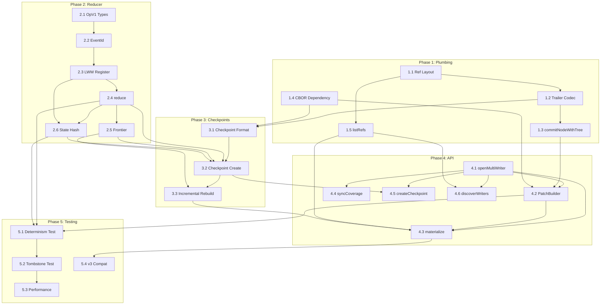

# SPEC-EMPTYGRAPH-WARP-0001: Multi-Writer Graph Database Protocol

**Version:** 1.0.0-draft
**Status:** Normative Specification
**Authors:** @flyingrobots
**Last Updated:** 2026-01-31

---

## Abstract

This specification defines WARP (Write-Ahead Replicated Patches), a protocol for multi-writer convergent graph databases built on Git. WARP enables independent writers to append operations to a shared graph with deterministic conflict resolution, leveraging Git's content-addressable storage and distribution model.

The protocol evolves through two major versions:
- **v4**: Multi-writer with LWW (Last-Writer-Wins) deterministic fold
- **v5**: True lattice confluence with CRDT state types

This document serves as both the normative specification and implementation roadmap.

---

## 1. Terminology

| Term | Definition |
|------|------------|
| **L plane** | Linus plane. The Git object graph (commits, refs, objects). Infrastructure layer. |
| **E plane** | EmptyGraph plane. The application-level graph (nodes, edges, properties). Domain layer. |
| **Patch** | A commit containing a batch of graph operations from a single writer. |
| **Writer** | An independent actor publishing patches. Has a unique writer ID and ref chain. |
| **EventId** | A tuple `(lamport, writer_id, patch_sha, op_index)` providing total order. |
| **Checkpoint** | A snapshot of materialized state at a known frontier. |
| **Frontier** | A map of `writer_id -> last_seen_patch_sha` representing processed state. |
| **Coverage** | An anchor commit ensuring all writer refs are reachable (optional GC convenience). |
| **LWW** | Last-Writer-Wins register. Conflict resolution by maximum EventId. |
| **OR-Set** | Observed-Remove Set. CRDT supporting concurrent add/remove. |
| **Lattice** | Algebraic structure where merge is commutative, associative, and idempotent. |

---

## 2. Goals and Non-Goals

### 2.1 Goals

1. **Multi-writer append** — Multiple writers can independently create patches without coordination.
2. **Deterministic merge** — Same patches always produce identical state (verified by state_hash).
3. **Git-native persistence** — All data stored as Git objects; distributed via standard Git protocols.
4. **Incremental recovery** — Checkpoints enable fast state reconstruction without replaying from genesis.
5. **Backward compatibility** — v4 tooling can open v3 graphs in legacy mode and import them into v4 by checkpointing.
6. **Path to confluence** — v4 design enables upgrade to v5 lattice semantics.

### 2.2 Non-Goals

1. **Real-time sync** — No pub/sub; polling via `git fetch` is expected.
2. **Fine-grained ACL** — Git repos are all-or-nothing; no per-node permissions.
3. **Query language** — Raw traversal primitives only; no Cypher/Gremlin.
4. **Sub-millisecond latency** — Each write involves Git I/O (~1-10ms).

---

## 3. Ref Layout (MUST)

All WARP refs live under `refs/empty-graph/<graph>/`:

```
refs/empty-graph/<graph>/
├── writers/
│   ├── <writer_id_1>     # Tip of writer's patch chain
│   ├── <writer_id_2>
│   └── ...
├── checkpoints/
│   └── head              # Latest checkpoint commit
└── coverage/
    └── head              # Anchor ensuring all writers reachable (OPTIONAL)
```

### 3.1 Writer Refs (MUST)

Each writer maintains its own ref:

```
refs/empty-graph/<graph>/writers/<writer_id>
```

- Points to the current HEAD of that writer's patch chain.
- Existence of these refs is sufficient for GC-safety of all patches reachable from them.

### 3.2 Writer Discovery (MUST)

To enumerate active writers:

```
git for-each-ref --format='%(refname:short)' refs/empty-graph/<graph>/writers/
```

Implementations MUST support dynamic writer discovery via ref listing.

### 3.3 Coverage Ref (OPTIONAL)

```
refs/empty-graph/<graph>/coverage/head
```

**Key insight**: Coverage is OPTIONAL because per-writer refs already provide GC safety. Coverage exists for:
- **Portability** — Single ref to clone the entire graph
- **Convenience** — One fetch covers all writers
- **Single entrypoint** — Tooling can start from one ref

When present, coverage MUST:
- Point to a commit whose parents include all current writer heads (octopus anchor)
- Be excluded from E-plane visible data (infrastructure only)

---

## 4. Commit Types and Message Encoding (MUST)

WARP commits use Git trailers for structured metadata. Commit kind MUST be encoded in trailers, not inferred by string sniffing.

### 4.1 Trailer Format

All commits MUST contain:
1. A non-empty title line
2. Optional body
3. A blank line separator
4. A trailer block of `key: value` lines

All EmptyGraph trailers MUST use the `eg-` prefix.

**Writer ID constraints (MUST):**
- `eg-writer` MUST be ASCII and ref-safe: `[A-Za-z0-9._-]`
- MUST be 1..64 chars
- MUST NOT contain `/`, `..`, whitespace, or NUL

### 4.2 Patch Commit

```
empty-graph:patch

eg-kind: patch
eg-graph: <graph_name>
eg-writer: <writer_id>
eg-lamport: <monotonic_counter>
eg-patch-oid: <blob_oid>
eg-schema: 1
```

**Trailer semantics:**
| Trailer | Description |
|---------|-------------|
| `eg-kind` | Discriminator for commit type (MUST be `patch`) |
| `eg-graph` | Graph namespace (allows multiple graphs per repo) |
| `eg-writer` | Unique writer identifier (SHOULD be UUID or hostname-based) |
| `eg-lamport` | Monotonic counter for total ordering (see Section 7) |
| `eg-patch-oid` | OID of the CBOR-encoded patch blob (MUST match `patch.cbor` in the commit tree) |
| `eg-schema` | Protocol schema version (MUST be `1` for v4) |

### 4.3 Checkpoint Commit

```
empty-graph:checkpoint

eg-kind: checkpoint
eg-graph: <graph_name>
eg-state-hash: <sha256_of_canonical_state>
eg-frontier-oid: <blob_oid>
eg-index-oid: <tree_oid>
eg-schema: 1
```

**Trailer/tree coherence (MUST):**
- `eg-frontier-oid` MUST match `frontier.cbor` in the checkpoint commit tree.
- `eg-index-oid` MUST match the checkpoint `index/` tree OID.

### 4.4 Anchor Commit (Infrastructure)

Anchors MUST be typed via trailers (no JSON sniffing). Anchor commits are infrastructure and MUST be filtered from E-plane traversals.

```
empty-graph:anchor

eg-kind: anchor
eg-graph: <graph_name>
eg-schema: 1
```

**Anchor invariants (MUST):**
- Anchor commit tree MUST be the empty tree.
- Anchor commit parents MUST be the commits that need to remain reachable (tips / coverage set).
- Anchor commits MUST NOT be interpreted as E-plane nodes/edges.

---

## 5. Attachment Layout (MUST)

Payloads MUST be stored in commit trees/blobs, not in commit message JSON. This is the two-plane model: skeleton (commits) vs attachments (trees/blobs).

### 5.1 Patch Commit Tree

```
<patch_commit_tree>/
├── patch.cbor           # CBOR-encoded PatchV1 (MUST)
├── footprint.cbor       # Read/write sets (v4 optional; v5 required)
└── notes/               # Debug info (not normative)
```

### 5.2 Checkpoint Commit Tree

```
<checkpoint_commit_tree>/
├── state.cbor           # Canonical state (or state/ for chunked)
├── frontier.cbor        # Writer frontiers
└── index/               # Bitmap index shards (existing v3 format)
```

---

## 6. Patch Schema (PatchV1)

### 6.1 PatchV1 Structure

```
PatchV1 {
  schema: u8,              # MUST be 1
  writer: string,          # Writer ID (matches eg-writer trailer)
  lamport: u64,            # Lamport timestamp
  ops: [OpV1],             # Ordered operations
  base_checkpoint?: Oid    # Optional: checkpoint this patch builds on
}
```

### 6.2 OpV1 (Operation Types)

```
OpV1 =
  | { type: "NodeAdd", node: NodeId }
  | { type: "NodeTombstone", node: NodeId }
  | { type: "EdgeAdd", from: NodeId, to: NodeId, label: string }
  | { type: "EdgeTombstone", from: NodeId, to: NodeId, label: string }
  | { type: "PropSet", node: NodeId, key: string, value: ValueRef }
```

**NodeId**: String identifier for nodes (e.g., `"user:alice"`, UUID).

### 6.3 ValueRef

```
ValueRef =
  | { type: "inline", value: any }     # Small values (< 1KB recommended)
  | { type: "blob", oid: Oid }         # Large values stored as Git blob
```

Inline scalar encoding MUST be deterministic.

### 6.4 Canonical Encoding (MUST)

For deterministic state hashes, CBOR encoding MUST be canonical:

1. **Map keys sorted** — Lexicographic ordering of UTF-8 encoded keys
2. **Stable iteration** — Same input always produces same byte sequence
3. **Minimal encoding** — Use shortest valid CBOR representation
4. **No indefinite lengths** — All arrays/maps have definite length

Implementations SHOULD use a CBOR library with deterministic mode (e.g., `cbor-x` with `canonical: true`).

---

## 7. EventId and Ordering

### 7.1 EventId Structure

```
EventId = (lamport: u64, writer_id: string, patch_sha: Oid, op_index: u32)
```

**Comparison**: Lexicographic ordering where:
1. Compare `lamport` numerically
2. Compare `writer_id` as ASCII bytes
3. Compare `patch_sha` as hex string
4. Compare `op_index` numerically

### 7.2 Lamport Persistence (MUST)

Writers MUST maintain monotonic lamport counters without external state:

```
On patch creation:
  if writer_ref exists:
    prev_patch = read(writer_ref)
    lamport = parse_lamport(prev_patch) + 1
  else:
    lamport = 1
```

Writers MUST NOT reset lamport counters. This prevents "reboot reset my lamport to 0" bugs.

---

## 8. Merge Policy v4 (LWW Join)

### 8.1 State Model (MUST)

The E-plane state consists of three LWW register maps:

```
node_alive: Map<NodeId, LWW<bool>>
edge_alive: Map<EdgeKey, LWW<bool>>
prop: Map<(NodeId, string), LWW<ValueRef>>

where:
  EdgeKey = (from: NodeId, to: NodeId, label: string)
  LWW<T> = { event_id: EventId, value: T }
```

### 8.2 Apply Semantics (MUST)

Given op with EventId `eid`:

| Operation | Effect |
|-----------|--------|
| `NodeAdd(n)` | `node_alive[n] = max(node_alive[n], (eid, true))` |
| `NodeTombstone(n)` | `node_alive[n] = max(node_alive[n], (eid, false))` |
| `EdgeAdd(e)` | `edge_alive[e] = max(edge_alive[e], (eid, true))` |
| `EdgeTombstone(e)` | `edge_alive[e] = max(edge_alive[e], (eid, false))` |
| `PropSet(n, k, v)` | `prop[(n, k)] = max(prop[(n, k)], (eid, v))` |

Where `max()` compares by EventId lexicographically.

### 8.3 Visibility Rules (MUST)

These predicates determine what is visible in the materialized graph:

```
nodeVisible(n) := node_alive[n].value == true

edgeVisible(e) := edge_alive[e].value == true
                  AND nodeVisible(e.from)
                  AND nodeVisible(e.to)

propVisible(n, k) := nodeVisible(n) AND prop[(n, k)] exists
```

**Tombstone cascading**: Tombstoned nodes automatically hide their edges and properties.

### 8.4 Rejection Policy (v4 Default)

v4 reducers MUST NOT reject ops by default. All ops are applied; visibility is a query-time filter.

Optional "strict mode" with asserts may be added later but is out of scope for baseline v4 confluence.

### 8.5 v4 is ~80% Lattice

LWW registers are already commutative, associative, and idempotent:

```
join(LWW(v1, e1), LWW(v2, e2)) =
  if e1 > e2 then LWW(v1, e1) else LWW(v2, e2)
```

**Implementation flexibility:**
- v4 baseline MUST NOT reject ops (Section 8.4).
- Therefore, v4 reducer MAY be implemented as per-key joins without global sorting.
- Global sorting is allowed as a simple reference implementation, but not required for correctness.
- This makes v4 closer to v5 join-based semantics.

---

## 9. Reduce Algorithm

### 9.1 Full Reduce (MUST)

```
reduce(patches):
  1. Collect all patch commits since checkpoint frontier
  2. Decode patches, expand to ops with EventIds
  3. Sort ops by EventId (total order)
  4. Apply sequentially to state using LWW semantics
  5. Return state_hash = sha256(canonical_state_bytes)
```

### 9.2 Frontier Tracking (MUST)

Checkpoints store:

```
frontier: Map<writer_id, last_seen_patch_sha>
```

### 9.3 Incremental Reduce

```
materialize_incremental(checkpoint, target_frontier):
  1. state = load(checkpoint.state)
  2. for each writer in target_frontier:
       walk patches from checkpoint.frontier[writer] to target_frontier[writer]
       collect new patches
  3. reduce(new_patches) into state
  4. return state
```

---

## 10. Checkpoints

### 10.1 Purpose

Checkpoints enable fast state recovery without replaying all patches from genesis.

### 10.2 Checkpoint Contents

| File | Description |
|------|-------------|
| `state.cbor` | Materialized E-plane state |
| `frontier.cbor` | `Map<writer_id, last_seen_patch_sha>` |
| `index/` | Bitmap index shards for O(1) traversal |

### 10.3 State Hash (MUST)

```
eg-state-hash = sha256(canonical_state_bytes)
```

**Canonical state bytes (MUST):**

`canonical_state_bytes` MUST be the canonical CBOR encoding of the **visible projection** of the E-plane state, with stable ordering:

1. **Nodes**: List all `NodeId` where `nodeVisible(node) == true`, sorted lexicographically by UTF-8 bytes of NodeId.
2. **Edges**: List all `EdgeKey` where `edgeVisible(edge) == true`, sorted lexicographically by:
   - `from` (UTF-8 bytes),
   - then `to` (UTF-8 bytes),
   - then `label` (UTF-8 bytes).
3. **Properties**: List all `(NodeId, key, ValueRef)` where `propVisible(node, key) == true`, sorted lexicographically by:
   - `node` (UTF-8 bytes),
   - then `key` (UTF-8 bytes).
4. **ValueRef encoding** MUST be deterministic:
   - Inline scalars MUST be encoded in canonical CBOR with stable typing.
   - OID references MUST be encoded as lowercase hex strings.

If two reducers produce identical visible state, they MUST produce identical `canonical_state_bytes` and identical `eg-state-hash`.

Checkpoint Git commit SHA MAY differ across machines (author/time metadata). The state hash MUST match across machines for identical inputs.

### 10.4 Index Binding

Checkpoint trees MUST reference the index root. Indexes MUST be derived from the same state used to compute `eg-state-hash`.

---

## 11. API Contract

### 11.1 Multi-Writer Graph Factory

```javascript
const graph = await EmptyGraph.openMultiWriter({
  persistence,
  graphName: 'events',
  writerId: 'node-1',
});
```

### 11.2 Patch Creation

```javascript
const patch = graph.createPatch();
patch.addNode('user:alice');
patch.addEdge('user:alice', 'group:admins', 'member-of');
patch.setProperty('user:alice', 'name', 'Alice');
await patch.commit();
```

`commit()` MUST:
1. Encode PatchV1 deterministically (canonical CBOR)
2. Write `patch.cbor` to blob
3. Create commit tree referencing the blob
4. Create patch commit with trailers
5. Advance the writer ref

### 11.3 State Materialization

```javascript
const state = await graph.materialize();                    // Current state
const state = await graph.materializeAt(checkpointOid);    // From checkpoint
```

### 11.4 Sync Operations

```javascript
await graph.syncCoverage();      // Update coverage anchor (optional)
await graph.createCheckpoint();  // Snapshot current state
const writers = await graph.discoverWriters();  // List writer refs
```

---

## 12. v5: True Lattice Confluence Path

### 12.1 PatchV2 Schema

```
PatchV2 {
  schema: 2,
  writer: string,
  lamport: u64,
  context: VersionVector,    # What writer had observed
  ops: [OpV2],               # Each op carries a dot
}
```

### 12.2 CRDT State Type Upgrades

**Nodes and Edges:**
- From: `LWW<bool>` (last-write-wins)
- To: `OR-Set` (Observed-Remove Set)
- Behavior: Concurrent add/tombstone → add wins (CRDT semantics)

**Properties:**
- Unchanged: `LWW<ValueRef>` is already a valid CRDT

### 12.3 Join-Based Merge

Replace sequential fold with commutative join:

```
merge(state, patch):
  for op in patch.ops:
    state = join(state, op)  # Order-independent!
  return state
```

Where `join` is commutative, associative, and idempotent.

---

## 13. Implementation Roadmap

### Phase 1: Plumbing (Foundation)

- [ ] **1.1** Define ref layout constants and helpers for `refs/empty-graph/<graph>/`
- [ ] **1.2** Integrate `@git-stunts/trailer-codec` for patch/checkpoint message encoding
- [ ] **1.3** Add `commitNodeWithTree(treeOid, parents, message)` to GitGraphAdapter
- [ ] **1.4** Add CBOR dependency (`cbor-x`) with canonical encoding mode
- [ ] **1.5** Add `listRefs(prefix)` to GitGraphAdapter for writer discovery

### Phase 2: Reducer v1 (Deterministic Fold)

- [ ] **2.1** Define OpV1 types and PatchV1 schema (TypeScript/JSDoc types)
- [ ] **2.2** Implement EventId comparison and sorting
- [ ] **2.3** Implement LWW register with EventId-based max()
- [ ] **2.4** Implement `reduce(patches)` algorithm
- [ ] **2.5** Implement frontier tracking (per-writer last-seen-sha)
- [ ] **2.6** Implement canonical state serialization and hashing

### Phase 3: Checkpoints

- [ ] **3.1** Define checkpoint commit format and tree structure
- [ ] **3.2** Implement checkpoint creation (serialize state + frontier + index)
- [ ] **3.3** Implement incremental rebuild from checkpoint

### Phase 4: API Surface

- [ ] **4.1** Implement `EmptyGraph.openMultiWriter()` factory
- [ ] **4.2** Implement `PatchBuilder` with fluent API
- [ ] **4.3** Implement `materialize()` and `materializeAt()`
- [ ] **4.4** Implement `syncCoverage()` reusing existing anchor logic
- [ ] **4.5** Implement `createCheckpoint()`
- [ ] **4.6** Implement `discoverWriters()`

### Phase 5: Testing & Validation

- [ ] **5.1** Determinism test: interleave patches A-then-B vs B-then-A → same state_hash
- [ ] **5.2** Tombstone stability test: concurrent add + tombstone + property-set
- [ ] **5.3** Performance benchmark: reduce 10K patches
- [ ] **5.4** v3 backward compatibility test: legacy-mode materialization + anchor filtering

### Phase 6: CRDT State Types (v5)

- [ ] **6.1** Implement OR-Set for node_alive
- [ ] **6.2** Implement OR-Set for edge_alive
- [ ] **6.3** Verify `LWW<ValueRef>` compatibility with dots

### Phase 7: Causal Context (v5)

- [ ] **7.1** Implement VersionVector type
- [ ] **7.2** Implement dot `(writer_id, counter)` assignment
- [ ] **7.3** Define PatchV2 schema with context field

### Phase 8: Join-Based Merge (v5)

- [ ] **8.1** Implement lattice join for OR-Set
- [ ] **8.2** Replace reduce with join-based merge
- [ ] **8.3** Verify commutativity, associativity, idempotence

### Phase 9: Verification (v5)

- [ ] **9.1** Content-addressed state verification
- [ ] **9.2** Merge receipts for audit trail

### Phase 10: Footprints (v5 Advanced)

- [ ] **10.1** Implement read/write set tracking per patch
- [ ] **10.2** Implement fast conflict detection via footprint overlap

---

## 14. Appendix: Invariants

### 14.1 Safety Invariants (MUST)

1. **Determinism** — Given identical patch sets, reducers MUST compute identical state hash
2. **Monotonicity** — Lamport timestamps strictly increase per writer
3. **Reachability** — All patches reachable from writer refs (or coverage ref if present)
4. **Two-plane** — Large payloads MUST live in attachments, not commit message JSON
5. **Metadata** — Commit kind MUST be encoded via trailers
6. **Index integrity** — Index roots MUST correspond to checkpoint's state hash

### 14.2 Visibility Invariants (MUST)

1. **Tombstone cascade** — Tombstoned node hides all its edges
2. **Property hiding** — Tombstoned node's properties are not visible
3. **Edge endpoint** — Edge only visible if both endpoints are visible

### 14.3 Critical Test Cases

**Test 1: Determinism Under Interleaving**
```
Writer A: NodeAdd("x"), PropSet("x", "a", 1)
Writer B: NodeAdd("y"), EdgeAdd("x", "y", "rel")

Replica 1 sees: A then B
Replica 2 sees: B then A

Verify: Both compute identical state_hash
```

**Test 2: Tombstone Stability**
```
Writer A: NodeAdd("x")           @ lamport=1
Writer B: NodeTombstone("x")     @ lamport=2
Writer C: PropSet("x", "k", "v") @ lamport=3

Verify: Deterministic resolution regardless of arrival order
Verify: If node tombstoned wins, edge/property queries return empty
```

---

## 15. Task Dependency Graph (DAG)



### Critical Path (v4.0.0)

The longest dependency chain determines minimum time to v4:

```
1.1 → 1.2 → 1.3 → [parallel: 2.1-2.6] → 3.2 → 4.5 → 5.3
```

**Estimated critical path duration: ~45-55 hours**

### Parallel Work Streams

| Stream | Tasks | Can Start After |
|--------|-------|-----------------|
| **Plumbing A** | 1.1 → 1.2 → 1.3 | Immediately |
| **Plumbing B** | 1.4 (CBOR) | Immediately |
| **Plumbing C** | 1.5 (listRefs) | After 1.1 |
| **Reducer** | 2.1 → 2.2 → 2.3 → 2.4 → 2.5/2.6 | After 1.4 |
| **Checkpoints** | 3.1 → 3.2 → 3.3 | After 1.2, 1.4, 2.6 |
| **API** | 4.1 → 4.2-4.6 | After 1.1, 1.2 |
| **Testing** | 5.1-5.4 | After 2.4, 4.2 |

---

## 16. Task Summary Table

### v4.0.0 Tasks (Phases 1-5)

| ID | Task | Hours | LOC | Blocked By | Blocks |
|----|------|-------|-----|------------|--------|
| **1.1** | Ref layout constants/helpers | 2-3 | 80-120 | — | 1.2, 1.5, 4.1 |
| **1.2** | Trailer codec integration | 3-4 | 150-200 | 1.1 | 1.3, 3.1 |
| **1.3** | commitNodeWithTree() | 1.5-2 | 40-50 | 1.2 | 4.2 |
| **1.4** | CBOR dependency | 2-3 | 60-80 | — | 2.1, 3.1 |
| **1.5** | listRefs() | 2-3 | 35-45 | 1.1 | 4.3, 4.6 |
| | **Phase 1 Total** | **11-15** | **365-495** | | |
| **2.1** | OpV1/PatchV1 types | 2-3 | 150-200 | 1.4 | 2.2, 2.4 |
| **2.2** | EventId comparison | 2-3 | 120-150 | 2.1 | 2.3, 2.4 |
| **2.3** | LWW register | 2 | 80-100 | 2.2 | 2.4, 2.6 |
| **2.4** | reduce() algorithm | 6-8 | 200-250 | 2.1, 2.2, 2.3 | 2.5, 2.6, 3.2, 5.1 |
| **2.5** | Frontier tracking | 3-4 | 100-120 | 2.4 | 3.2, 3.3 |
| **2.6** | State serialization/hashing | 5-6 | 180-220 | 2.3, 2.4 | 3.2, 5.1 |
| | **Phase 2 Total** | **20-27** | **830-1040** | | |
| **3.1** | Checkpoint format | 3-4 | 150-200 | 1.2, 1.4 | 3.2 |
| **3.2** | Checkpoint creation | 6-8 | 250-300 | 3.1, 2.4, 2.5, 2.6 | 3.3, 4.5 |
| **3.3** | Incremental rebuild | 5-6 | 200-250 | 3.2, 2.5 | 4.3 |
| | **Phase 3 Total** | **14-18** | **600-750** | | |
| **4.1** | openMultiWriter() factory | 3-4 | 150-200 | 1.1, 1.2 | 4.2-4.6 |
| **4.2** | PatchBuilder | 6-8 | 300-350 | 4.1, 1.3, 1.4, 2.1 | 4.3, 5.1 |
| **4.3** | materialize() | 6-8 | 250-300 | 4.1, 2.4, 3.3, 1.5 | 5.1, 5.3 |
| **4.4** | syncCoverage() | 2-3 | 100-150 | 4.1, 1.5 | — |
| **4.5** | createCheckpoint() | 3-4 | 100-120 | 4.1, 4.3, 3.2 | 5.3 |
| **4.6** | discoverWriters() | 1-2 | 60-80 | 4.1, 1.5 | 4.3 |
| | **Phase 4 Total** | **21-29** | **960-1200** | | |
| **5.1** | Determinism test | 8-10 | 450-550 | 2.4, 2.6, 4.2, 4.3 | 5.2 |
| **5.2** | Tombstone stability test | 10-12 | 550-650 | 5.1 | 5.3 |
| **5.3** | Performance benchmark | 12-14 | 600-700 | 5.2, 4.5 | — |
| **5.4** | v3 backward compatibility | 6-8 | 400-500 | 2.4, 4.3 | — |
| | **Phase 5 Total** | **36-44** | **2000-2400** | | |
| | **v4.0.0 GRAND TOTAL** | **102-133** | **4755-5885** | | |

### v5.0.0 Tasks (Phases 6-10)

| ID | Task | Hours | LOC | Blocked By | Blocks |
|----|------|-------|-----|------------|--------|
| **6.1** | OR-Set for nodes | 4-6 | 150-200 | — | 6.2, 8.1 |
| **6.2** | OR-Set for edges | 3-4 | 120-150 | 6.1 | 8.1 |
| **6.3** | LWW with dots | 3-4 | 100-130 | — | 8.2 |
| | **Phase 6 Total** | **10-14** | **370-480** | | |
| **7.1** | VersionVector | 4-5 | 120-150 | — | 7.2, 7.3 |
| **7.2** | Dot assignment | 2-3 | 80-100 | 7.1 | 7.3, 8.1 |
| **7.3** | PatchV2 schema | 4-5 | 150-200 | 7.1, 7.2 | 8.1, 8.2 |
| | **Phase 7 Total** | **10-13** | **350-450** | | |
| **8.1** | OR-Set join | 5-6 | 100-150 | 6.1, 6.2, 7.2 | 8.2 |
| **8.2** | Join-based reducer | 8-10 | 200-250 | 8.1, 7.3, 6.3 | 8.3, 9.1 |
| **8.3** | Lattice property tests | 6-8 | 150-200 | 8.2 | 9.1 |
| | **Phase 8 Total** | **19-24** | **450-600** | | |
| **9.1** | State verification | 4-5 | 120-150 | 8.2 | 9.2 |
| **9.2** | Merge receipts | 3-4 | 100-130 | 9.1 | — |
| | **Phase 9 Total** | **7-9** | **220-280** | | |
| **10.1** | Footprint tracking | 5-6 | 150-180 | — | 10.2 |
| **10.2** | Conflict detection | 4-5 | 100-130 | 10.1 | — |
| | **Phase 10 Total** | **9-11** | **250-310** | | |
| | **v5.0.0 GRAND TOTAL** | **55-71** | **1640-2120** | | |

---

## 17. Detailed Task Specifications

### Phase 1: Plumbing

#### Task 1.1: Ref Layout Constants and Helpers

**Requirements:**
- Create module defining WARP ref layout constants
- Helper functions: `buildWriterRef()`, `buildCheckpointRef()`, `buildCoverageRef()`
- `parseWriterIdFromRef()` to extract writer ID from ref path
- `validateGraphName()` to prevent injection attacks

**Acceptance Criteria:**
1. `buildWriterRef('events', 'node-1')` → `refs/empty-graph/events/writers/node-1`
2. `parseWriterIdFromRef('refs/empty-graph/events/writers/alice')` → `'alice'`
3. Rejects graph names with `../`, `;`, spaces, or null bytes
4. 100% test coverage for edge cases

**Scope:**
- IN: Pure string manipulation, validation
- OUT: Git I/O, ref creation

**Example:**
```javascript
import { buildWriterRef, validateGraphName } from './RefLayout.js';
validateGraphName('my-graph'); // OK
buildWriterRef('my-graph', 'writer-1'); // 'refs/empty-graph/my-graph/writers/writer-1'
```

**Test Fixtures:**
```javascript
const VALID_GRAPH_NAMES = ['my-graph', 'prod_system', 'x'.repeat(255)];
const INVALID_GRAPH_NAMES = ['', '../etc', 'graph; rm -rf', 'with spaces'];
```

**Complexity:** 80-120 LOC | **Hours:** 2-3 | **Blocks:** 1.2, 1.5, 4.1

---

#### Task 1.2: Trailer Codec Integration

**Requirements:**
- Import `@git-stunts/trailer-codec` (already a dependency)
- `encodePatchMessage({ graph, writer, lamport, patchOid, schema })`
- `encodeCheckpointMessage({ graph, stateHash, frontierOid, indexOid, schema })`
- Corresponding decode functions with validation

**Acceptance Criteria:**
1. Encoded messages match spec format (Section 4.2, 4.3)
2. Round-trip encode→decode preserves all fields
3. Decoder throws on missing required trailers
4. Decoder validates `eg-kind` discriminator

**Scope:**
- IN: Message encoding/decoding, validation
- OUT: Commit creation, CBOR payloads

**Example:**
```javascript
const msg = encodePatchMessage({
  graph: 'events', writer: 'node-1', lamport: 42,
  patchOid: 'abc123', schema: 1
});
// "empty-graph:patch\n\neg-kind: patch\neg-graph: events\n..."
```

**Test Fixtures:**
```javascript
const PATCH_METADATA = { graph: 'test', writer: 'w1', lamport: 1, patchOid: 'abc', schema: 1 };
const MALFORMED = ['no trailers', 'title\n\neg-graph: foo']; // missing eg-kind
```

**Complexity:** 150-200 LOC | **Hours:** 3-4 | **Blocks:** 1.3, 3.1

---

#### Task 1.3: commitNodeWithTree()

**Requirements:**
- Add method to `GitGraphAdapter`: `commitNodeWithTree({ treeOid, parents, message, sign })`
- Uses `git commit-tree <treeOid> -p <parents...> -m <message>`
- Validates treeOid format (hex, 4-64 chars)
- Retry logic via existing `_executeWithRetry()`

**Acceptance Criteria:**
1. Creates commit pointing to provided tree (not empty tree)
2. Supports multiple parents
3. Returns trimmed SHA
4. Validation rejects invalid OIDs before Git call

**Scope:**
- IN: Single new method, validation, retry
- OUT: Tree creation (use existing `writeTree()`)

**Example:**
```javascript
const blobOid = await adapter.writeBlob(cborData);
const treeOid = await adapter.writeTree([`100644 blob ${blobOid}\tpatch.cbor`]);
const commitSha = await adapter.commitNodeWithTree({ treeOid, parents: [], message });
```

**Complexity:** 40-50 LOC | **Hours:** 1.5-2 | **Blocks:** 4.2

---

#### Task 1.4: CBOR Dependency

**Requirements:**
- Add `cbor-x` to package.json (`^1.6.0`)
- Create wrapper: `src/infrastructure/codecs/CborCodec.js`
- Configure canonical mode: `{ mapsAsObjects: true, canonical: true, useRecords: false }`
- Export `encode(data)` and `decode(buffer)`

**Acceptance Criteria:**
1. Same input always produces identical bytes (determinism test)
2. Round-trip preserves data
3. Map keys are sorted in output
4. Handles nested structures, unicode, large integers

**Scope:**
- IN: Package addition, thin wrapper
- OUT: Schema definitions, streaming

**Example:**
```javascript
const bytes = encode({ z: 1, a: 2 }); // keys sorted: a, z
const data = decode(bytes);
```

**Complexity:** 60-80 LOC | **Hours:** 2-3 | **Blocks:** 2.1, 3.1

---

#### Task 1.5: listRefs()

**Requirements:**
- Add method to `GitGraphAdapter`: `listRefs(prefix)`
- Uses `git for-each-ref --format='%(refname)' <prefix>`
- Returns array of ref paths
- Validates prefix (same rules as `_validateRef`)

**Acceptance Criteria:**
1. `listRefs('refs/empty-graph/events/writers/')` returns writer refs
2. Returns empty array when no matches
3. Rejects injection patterns in prefix
4. Uses retry logic

**Scope:**
- IN: Single new method
- OUT: Ref value reading, writer ID parsing

**Example:**
```javascript
const refs = await adapter.listRefs('refs/empty-graph/events/writers/');
// ['refs/empty-graph/events/writers/alice', 'refs/empty-graph/events/writers/bob']
```

**Complexity:** 35-45 LOC | **Hours:** 2-3 | **Blocks:** 4.3, 4.6

---

### Phase 2: Reducer v1

#### Task 2.1: OpV1 Types and PatchV1 Schema

**Requirements:**
- Define JSDoc types for all OpV1 variants
- Define PatchV1 container type
- Define ValueRef (inline | blob) type
- Define NodeId, EdgeKey types

**Acceptance Criteria:**
1. Types compile with TypeScript `tsc --noEmit`
2. JSDoc renders in IDE autocomplete
3. Operation discriminator field (`type`) enables pattern matching
4. All types documented with canonical CBOR requirements

**Scope:**
- IN: Type definitions, JSDoc
- OUT: Runtime validation, CBOR encoding

**Example:**
```javascript
/** @typedef {{ type: 'NodeAdd', node: NodeId }} OpNodeAdd */
/** @typedef {{ schema: 1, writer: string, lamport: number, ops: OpV1[] }} PatchV1 */
```

**Complexity:** 150-200 LOC | **Hours:** 2-3 | **Blocks:** 2.2, 2.4

---

#### Task 2.2: EventId Comparison

**Requirements:**
- Define EventId type: `{ lamport, writerId, patchSha, opIndex }`
- `compareEventIds(a, b)` returns -1, 0, or 1
- Lexicographic: lamport → writerId → patchSha → opIndex
- `createEventId()` factory with validation

**Acceptance Criteria:**
1. Standard comparator for `Array.sort()`
2. Early exit on lamport mismatch (performance)
3. Rejects invalid inputs (negative lamport, empty writerId)
4. Test coverage for all comparison branches

**Scope:**
- IN: Type, comparator, factory, validation
- OUT: Persistence, lamport clock logic

**Example:**
```javascript
const e1 = createEventId(10, 'alice', 'sha1', 0);
const e2 = createEventId(10, 'bob', 'sha2', 0);
compareEventIds(e1, e2); // -1 ('alice' < 'bob')
```

**Test Fixtures:**
```javascript
const fixtures = {
  e1: { lamport: 1, writerId: 'w1', patchSha: 'a'.repeat(40), opIndex: 0 },
  e2: { lamport: 2, writerId: 'w1', patchSha: 'a'.repeat(40), opIndex: 0 },
  // Same lamport, different writer
  e3: { lamport: 1, writerId: 'w2', patchSha: 'a'.repeat(40), opIndex: 0 },
};
```

**Complexity:** 120-150 LOC | **Hours:** 2-3 | **Blocks:** 2.3, 2.4

---

#### Task 2.3: LWW Register

**Requirements:**
- `LWW<T> = { event_id: EventId, value: T }`
- `lwwMax(a, b)` returns register with greater EventId
- `lwwSet(eventId, value)` constructor
- Handles null/undefined (no previous value)

**Acceptance Criteria:**
1. `lwwMax()` is commutative
2. Equal EventIds → first argument wins (deterministic)
3. Null handling: `lwwMax(null, lww)` → lww
4. Generic over value type (bool, ValueRef)

**Scope:**
- IN: LWW type, max function
- OUT: State containers (Map of LWWs)

**Example:**
```javascript
const reg1 = lwwSet(e1, true);
const reg2 = lwwSet(e2, false);
const merged = lwwMax(reg1, reg2); // e2 wins if e2 > e1
```

**Complexity:** 80-100 LOC | **Hours:** 2 | **Blocks:** 2.4, 2.6

---

#### Task 2.4: reduce() Algorithm

**Requirements:**
- `reduce(patches)` returns state with `node_alive`, `edge_alive`, `prop` maps
- Expand patches to `(EventId, Op)` tuples
- Sort by EventId (total order)
- Apply sequentially using LWW semantics
- No mutations to input

**Acceptance Criteria:**
1. Same patches in different order → identical state
2. Handles all 5 operation types
3. O(N log N) for N total operations
4. Empty patches array → empty state

**Scope:**
- IN: Core reduce algorithm, operation expansion
- OUT: Patch decoding, visibility predicates

**Example:**
```javascript
const state = reduce([patchA, patchB]);
// state.node_alive.get('user:alice') → { eventId, value: true }
```

**Test Fixtures:**
```javascript
const testScenarios = {
  simpleNodeAdd: { patches: [...], expectedState: { node_alive: {...} } },
  concurrentTombstone: { patches: [...], expectedState: {...} },
  lwwProperty: { patches: [...], expectedState: {...} }
};
```

**Complexity:** 200-250 LOC | **Hours:** 6-8 | **Blocks:** 2.5, 2.6, 3.2, 5.1

---

#### Task 2.5: Frontier Tracking

**Requirements:**
- Frontier: `Map<writer_id, last_seen_patch_sha>`
- `updateFrontier(frontier, patch)` mutates frontier
- `serializeFrontier()` / `deserializeFrontier()` with canonical JSON
- `patchesSinceFrontier()` helper for incremental reduce

**Acceptance Criteria:**
1. Frontier serialization is deterministic (sorted keys)
2. Round-trip preserves all entries
3. Incremental reduce uses frontier correctly

**Scope:**
- IN: Frontier data structure, serialization
- OUT: Git ref traversal, checkpoint creation

**Complexity:** 100-120 LOC | **Hours:** 3-4 | **Blocks:** 3.2, 3.3

---

#### Task 2.6: State Serialization and Hashing

**Requirements:**
- `serializeState(state)` → canonical CBOR Buffer
- `computeStateHash(state)` → SHA-256 hex string
- `deserializeState(buffer)` → reconstructed state
- Visibility predicates: `nodeVisible()`, `edgeVisible()`, `propVisible()`

**Acceptance Criteria:**
1. Same state always produces identical bytes
2. `state_hash = sha256(canonical_state_bytes)`
3. Serialize→deserialize→rehash produces same hash
4. Visibility predicates match spec (Section 8.3)

**Scope:**
- IN: Canonical encoding, hashing, visibility
- OUT: Checkpoint creation (Phase 3)

**Example:**
```javascript
const bytes = serializeState(state);
const hash = computeStateHash(state);
nodeVisible(state, 'user:alice'); // true if node_alive['user:alice'].value === true
```

**Complexity:** 180-220 LOC | **Hours:** 5-6 | **Blocks:** 3.2, 5.1

---

### Phase 3: Checkpoints

#### Task 3.1: Checkpoint Format

**Requirements:**
- Define trailer format for checkpoint commits
- Define tree structure: `state.cbor`, `frontier.cbor`, `index/`
- Define CBOR schemas for state and frontier
- State hash computation algorithm

**Acceptance Criteria:**
1. Checkpoint trailers documented (eg-kind, eg-state-hash, etc.)
2. Tree structure matches spec Section 5.2
3. State hash is SHA-256 of canonical state CBOR

**Complexity:** 150-200 LOC | **Hours:** 3-4 | **Blocks:** 3.2

---

#### Task 3.2: Checkpoint Creation

**Requirements:**
- `CheckpointService.create(graphName, frontier)` returns checkpoint SHA
- Materialize state from patches
- Serialize state, frontier, index to tree
- Write checkpoint commit with trailers
- Update checkpoint ref

**Acceptance Criteria:**
1. Checkpoint contains correct state for frontier
2. State hash in trailer matches computed hash
3. Checkpoint ref updated atomically
4. Handles empty state (genesis checkpoint)

**Complexity:** 250-300 LOC | **Hours:** 6-8 | **Blocks:** 3.3, 4.5

---

#### Task 3.3: Incremental Rebuild

**Requirements:**
- `loadState(checkpointSha)` returns state + frontier
- `materializeIncremental(checkpoint, targetFrontier)` processes only new patches
- Walk patches from frontier to target per writer

**Acceptance Criteria:**
1. Incremental reduce == full reduce (determinism)
2. O(new patches), not O(all patches)
3. Handles new writers not in checkpoint frontier

**Complexity:** 200-250 LOC | **Hours:** 5-6 | **Blocks:** 4.3

---

### Phase 4: API Surface

#### Task 4.1: openMultiWriter() Factory

**Requirements:**
- `EmptyGraph.openMultiWriter({ persistence, graphName, writerId })`
- Returns `MultiWriterGraph` instance
- Validates graphName and writerId
- Initializes services (reducer, checkpoint, patch builder)

**Acceptance Criteria:**
1. Returns instance with expected methods
2. Rejects invalid graph names / writer IDs
3. Services initialized correctly

**Complexity:** 150-200 LOC | **Hours:** 3-4 | **Blocks:** 4.2-4.6

---

#### Task 4.2: PatchBuilder

**Requirements:**
- Fluent API: `addNode()`, `removeNode()`, `addEdge()`, `removeEdge()`, `setProperty()`
- `commit()` encodes patch, writes blob, creates commit, advances ref
- Auto-increment lamport from previous patch
- Validates operation parameters

**Acceptance Criteria:**
1. Chaining: `patch.addNode('a').addEdge('a', 'b', 'rel').commit()`
2. Commit creates valid patch commit with trailers
3. Writer ref advanced to new commit
4. Empty patches rejected

**Complexity:** 300-350 LOC | **Hours:** 6-8 | **Blocks:** 4.3, 5.1

---

#### Task 4.3: materialize()

**Requirements:**
- `graph.materialize()` reduces all patches to current frontier
- `graph.materializeAt(checkpointSha)` incrementally from checkpoint
- Discover writers via listRefs
- Cache last materialized state

**Acceptance Criteria:**
1. Returns complete state object
2. Both methods produce identical state for same patches
3. Handles empty graph, single writer, multiple writers

**Complexity:** 250-300 LOC | **Hours:** 6-8 | **Blocks:** 5.1, 5.3

---

#### Task 4.4: syncCoverage()

**Requirements:**
- Update `refs/empty-graph/<graph>/coverage/head`
- Collect all writer tips
- Create octopus anchor with tips as parents
- Reuse `GraphRefManager.syncHead()` logic

**Acceptance Criteria:**
1. Coverage commit is octopus anchor
2. All writer tips reachable from coverage
3. Fast-forward if possible

**Complexity:** 100-150 LOC | **Hours:** 2-3 | **Blocks:** —

---

#### Task 4.5: createCheckpoint()

**Requirements:**
- `graph.createCheckpoint()` snapshots current state
- Collect frontier, materialize state
- Delegate to CheckpointService
- Update checkpoint ref

**Acceptance Criteria:**
1. Returns checkpoint SHA
2. Checkpoint ref updated
3. Can load and materialize to same state

**Complexity:** 100-120 LOC | **Hours:** 3-4 | **Blocks:** 5.3

---

#### Task 4.6: discoverWriters()

**Requirements:**
- `graph.discoverWriters()` lists active writer IDs
- Query refs under `refs/empty-graph/<graph>/writers/`
- Sort alphabetically
- Filter invalid refs

**Acceptance Criteria:**
1. Returns sorted array of writer ID strings
2. Handles empty graph
3. Excludes invalid refs

**Complexity:** 60-80 LOC | **Hours:** 1-2 | **Blocks:** 4.3

---

### Phase 5: Testing & Validation

#### Task 5.1: Determinism Test

**Requirements:**
- Verify `reduce([A, B])` == `reduce([B, A])` for any patches A, B
- Test all 5 operation types
- Multiple interleaving permutations
- State hash comparison

**Acceptance Criteria:**
1. All permutations produce identical state_hash
2. Covers concurrent ops on same/different nodes
3. 6 comprehensive test fixtures

**Test Fixtures:**
```javascript
const FIXTURE_BASIC = {
  writerA: { patches: [{ lamport: 1, ops: [{ type: 'NodeAdd', node: 'x' }] }] },
  writerB: { patches: [{ lamport: 1, ops: [{ type: 'NodeAdd', node: 'y' }] }] },
  // Both orderings produce same hash
};
```

**Complexity:** 450-550 LOC | **Hours:** 8-10 | **Blocks:** 5.2

---

#### Task 5.2: Tombstone Stability Test

**Requirements:**
- Three-writer scenario: Add, Tombstone, PropSet on same node
- All 6 permutations produce same state
- Verify visibility rules (tombstone cascade)

**Acceptance Criteria:**
1. LWW semantics correct (highest EventId wins)
2. Tombstoned nodes hide edges/properties
3. 8 comprehensive fixtures

**Test Fixtures:**
```javascript
const FIXTURE_TOMBSTONE = {
  writerA: { patches: [{ lamport: 1, ops: [{ type: 'NodeAdd', node: 'x' }] }] },
  writerB: { patches: [{ lamport: 2, ops: [{ type: 'NodeTombstone', node: 'x' }] }] },
  writerC: { patches: [{ lamport: 3, ops: [{ type: 'PropSet', node: 'x', key: 'k', value: {...} }] }] },
  // PropSet at lamport=3 wins, node visible
};
```

**Complexity:** 550-650 LOC | **Hours:** 10-12 | **Blocks:** 5.3

---

#### Task 5.3: Performance Benchmark

**Requirements:**
- Benchmark reduce of 10K patches
- Measure checkpoint speedup (incremental vs full)
- Memory profiling
- Scaling tests (1K, 5K, 10K, 25K)

**Acceptance Criteria:**
1. 10K patches in < 5 seconds
2. Incremental reduce 10x+ faster
3. Memory under 500MB
4. Linear scaling

**Test Fixtures:**
```javascript
const BENCHMARK_CONFIG = {
  patchCount: 10000,
  writerCount: 10,
  avgOpsPerPatch: 5,
  expectedMetrics: { maxReduceTime: 5000, maxMemoryMB: 500 }
};
```

**Complexity:** 600-700 LOC | **Hours:** 12-14 | **Blocks:** —

---

#### Task 5.4: v3 Backward Compatibility

**Requirements:**
- v4 tooling supports reading v3 graphs in **legacy mode**:
  - Each v3 node commit maps to an implicit `NodeAdd(node=<sha>)` op.
  - Node payload MAY be derived from v3 commit message (legacy only).
- v3 anchor commits MUST be filtered during legacy materialization.
- Mixed v3 + v4 support MUST be explicit (legacy graphs are not automatically "patch graphs").

**Acceptance Criteria:**
1. v3 graph materializes correctly in legacy mode
2. Both JSON anchors (v3) and trailer anchors (v4+) filtered from E-plane
3. Mixed graph works with explicit legacy adapter

**Test Fixtures:**
```javascript
const V3_FIXTURE = {
  commits: [
    { sha: 'v3-1', message: 'Event 1', parents: [] },
    // legacy anchor format (v3)
    { sha: 'anchor-json', message: '{"_type":"anchor"}', parents: ['v3-1'] },
    // new anchor format (v4+); legacy reader SHOULD ignore as infrastructure too
    { sha: 'anchor-trailer', message: 'empty-graph:anchor\n\neg-kind: anchor\neg-graph: g\neg-schema: 1\n', parents: ['v3-1'] }
  ],
  expectedState: { nodes: ['v3-1'] } // anchors filtered
};
```

**Complexity:** 400-500 LOC | **Hours:** 6-8 | **Blocks:** —

---

## 18. Shared Test Fixtures

### Common EventId Fixtures
```javascript
export const EVENT_IDS = {
  early: { lamport: 1, writerId: 'w1', patchSha: 'a'.repeat(40), opIndex: 0 },
  mid: { lamport: 5, writerId: 'w1', patchSha: 'b'.repeat(40), opIndex: 0 },
  late: { lamport: 10, writerId: 'w1', patchSha: 'c'.repeat(40), opIndex: 0 },
  concurrent1: { lamport: 5, writerId: 'w1', patchSha: 'd'.repeat(40), opIndex: 0 },
  concurrent2: { lamport: 5, writerId: 'w2', patchSha: 'e'.repeat(40), opIndex: 0 },
};
```

### Common Patch Fixtures
```javascript
export const PATCHES = {
  addAlice: {
    writer: 'w1', lamport: 1, ops: [
      { type: 'NodeAdd', node: 'user:alice' },
      { type: 'PropSet', node: 'user:alice', key: 'name', value: { type: 'inline', value: 'Alice' } }
    ]
  },
  addBob: {
    writer: 'w2', lamport: 1, ops: [
      { type: 'NodeAdd', node: 'user:bob' }
    ]
  },
  linkAliceBob: {
    writer: 'w1', lamport: 2, ops: [
      { type: 'EdgeAdd', from: 'user:alice', to: 'user:bob', label: 'follows' }
    ]
  },
  tombstoneAlice: {
    writer: 'w2', lamport: 3, ops: [
      { type: 'NodeTombstone', node: 'user:alice' }
    ]
  }
};
```

### Common State Fixtures
```javascript
export const STATES = {
  empty: { node_alive: new Map(), edge_alive: new Map(), prop: new Map() },
  aliceOnly: {
    node_alive: new Map([['user:alice', { eventId: EVENT_IDS.early, value: true }]]),
    edge_alive: new Map(),
    prop: new Map([['user:alice|name', { eventId: EVENT_IDS.early, value: { type: 'inline', value: 'Alice' } }]])
  }
};
```

---

## 19. References

- [SEMANTICS.md](../SEMANTICS.md) — Durability contract
- [ANCHORING.md](./ANCHORING.md) — Anchor commit mechanics
- [ARCHITECTURE.md](./ARCHITECTURE.md) — Hexagonal architecture overview
- [@git-stunts/trailer-codec](https://github.com/git-stunts/trailer-codec) — Commit message encoding
- [WARP Papers I-IV](../paper-*.tex) — Theoretical foundation
