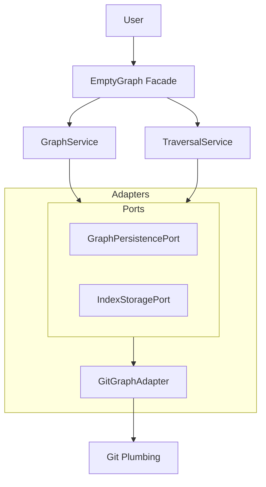

# Architecture

EmptyGraph follows a strict **Hexagonal Architecture** (Ports & Adapters).

## The Hexagon

## Components

- **Domain Layer:** Pure logic. `GraphService` manages nodes, `TraversalService` manages walking the graph.
- **Ports Layer:** Interfaces that define *how* we talk to the outside world.
- **Adapters Layer:** The implementation. `GitGraphAdapter` translates our domain calls into `git` CLI commands.

## Why this matters

This decoupling means the "Brain" (Traversal) doesn't know it's running on Git. It just asks for "neighbors." This allowed us to swap in the Bitmap Index without changing the traversal algorithms.
