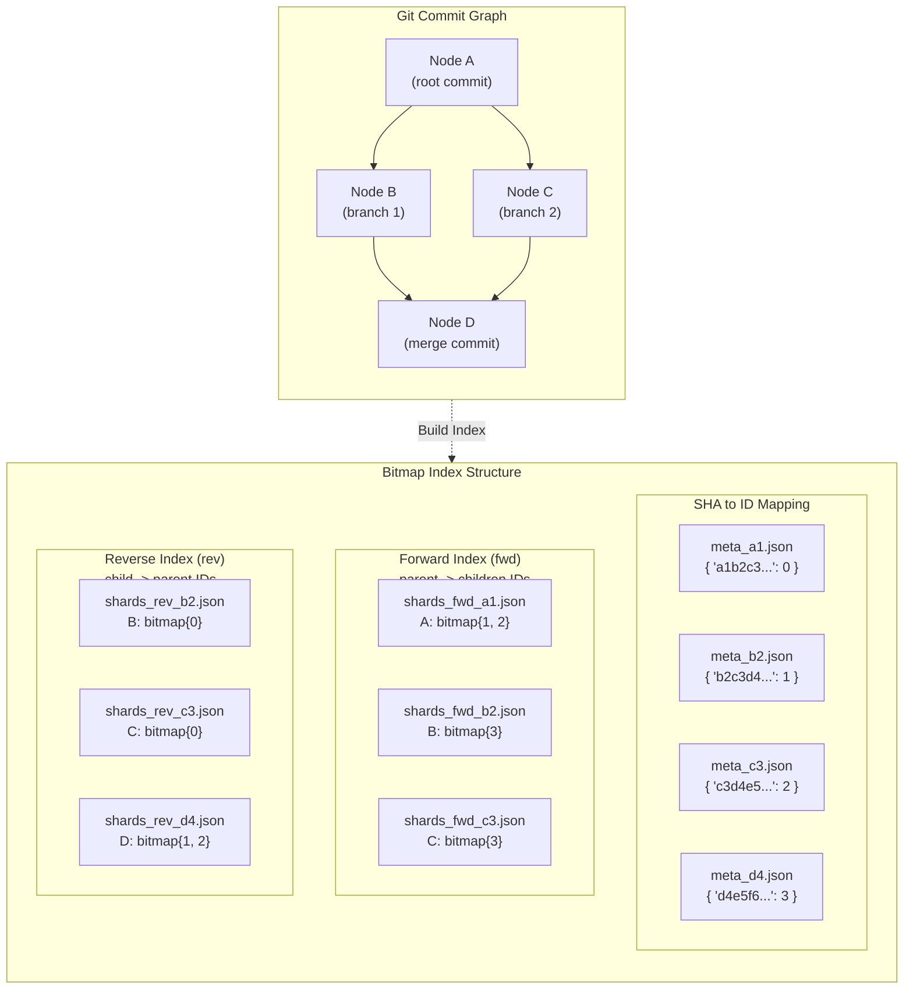
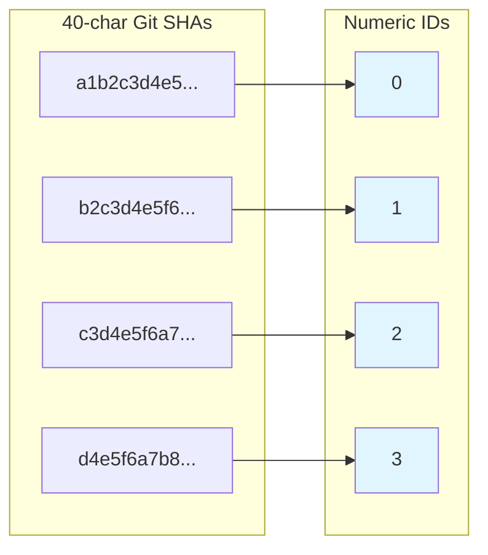
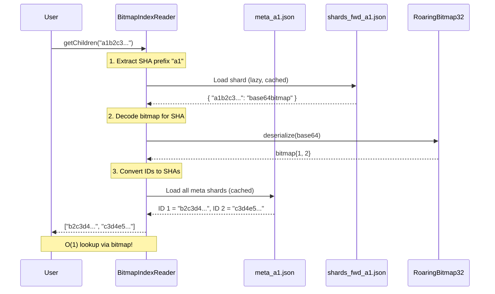
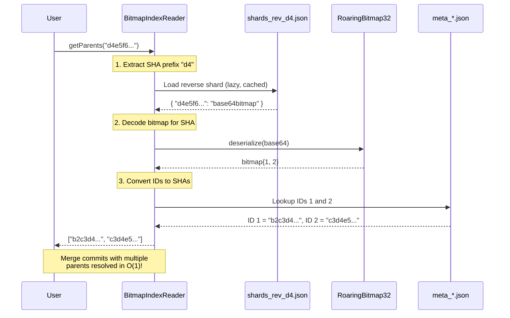
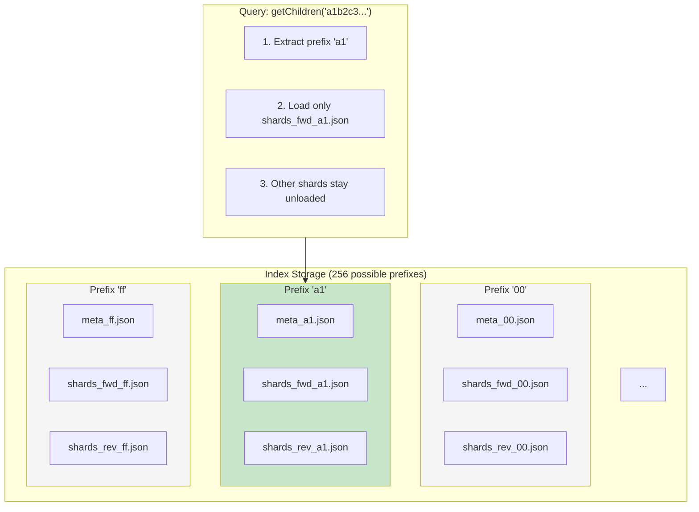
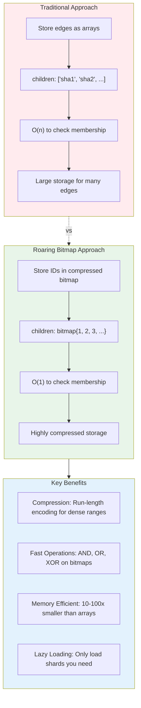
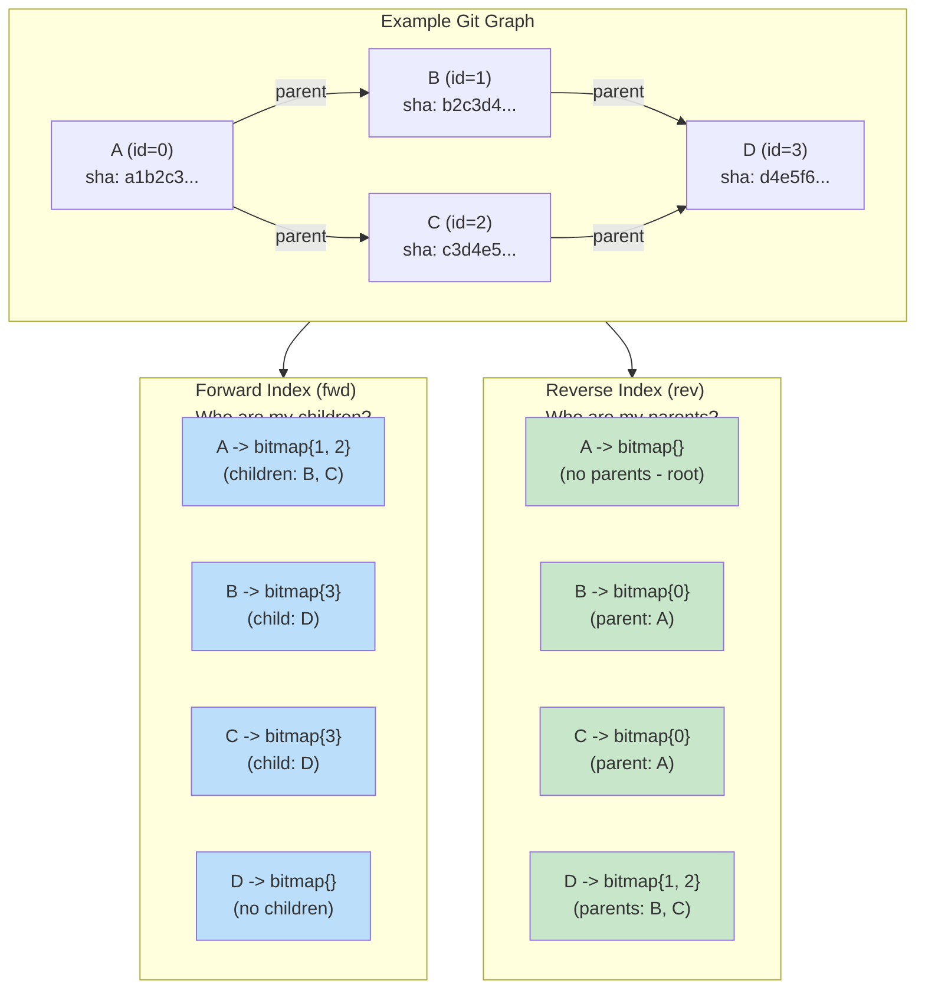
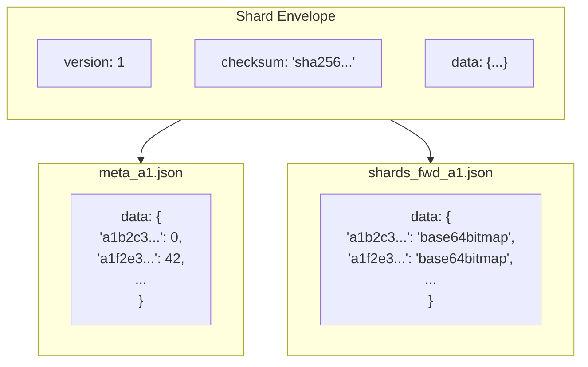

# Roaring Bitmap Index Architecture

This diagram illustrates how EMPTY GRAPH uses Roaring Bitmaps to provide O(1) lookups for graph traversal operations.

## Overview Diagram

## SHA to Numeric ID Mapping

SHAs are mapped to compact numeric IDs for efficient bitmap storage:

## Query Flow: getChildren(A)

> **Warning**: First query loads all meta shards O(n); subsequent queries O(1)
>
> `BitmapIndexReader.getChildren` depends on `_buildIdToShaMapping` which loads all meta shards (up to 256) on the first query. Only subsequent lookups are O(1). Note that the LRU cache (default 100) can be exceeded during initial load.

## Query Flow: getParents(D)

## Sharding Strategy

Shards are organized by 2-character SHA prefix for efficient lazy loading:

## Why Roaring Bitmaps Are Fast

## Complete Index Structure Example

## Shard File Format

Each shard file contains a versioned envelope with checksum for integrity:

## Summary

| Component | Purpose | Lookup Time |
| --------- | ------- | ----------- |
| `meta_XX.json` | SHA to numeric ID mapping | O(1) |
| `shards_fwd_XX.json` | Forward edges (parent to children) | O(1) |
| `shards_rev_XX.json` | Reverse edges (child to parents) | O(1) |
| LRU Cache | Avoid re-loading recently used shards | O(1) |

The combination of:
1. **Numeric IDs** (compact representation)
2. **Roaring Bitmaps** (compressed, fast set operations)
3. **Sharding by prefix** (lazy loading, reduced memory)
4. **LRU caching** (avoid repeated I/O)

...enables EMPTY GRAPH to traverse massive Git commit graphs with constant-time lookups.
